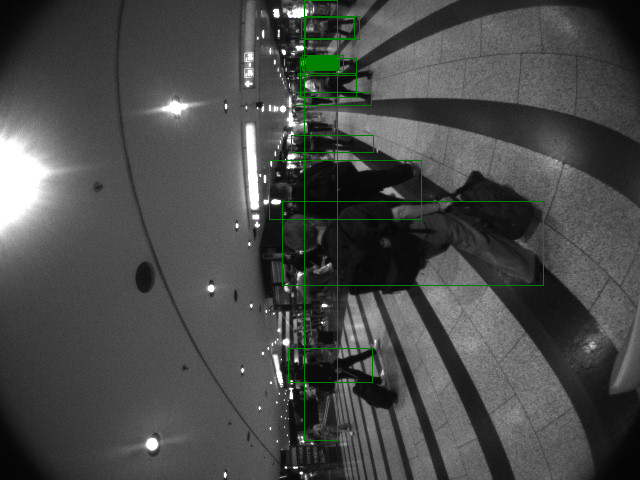

# LocateAnything: Object Detection and Bounding-Box Annotation

`bb_utils.locate_anything` provides a script that runs the
[NVIDIA LocateAnything](https://huggingface.co/nvidia/LocateAnything-3B) model
on one image or an entire folder of images and saves annotated copies with
bounding boxes drawn on them.

---

## Table of Contents

- [Overview](#overview)
- [Prerequisites](#prerequisites)
- [Installation](#installation)
- [Configuration](#configuration)
- [Usage](#usage)
  - [Single image](#single-image)
  - [Folder of images](#folder-of-images)
- [Output](#output)
- [Script internals](#script-internals)

---

## Overview

`bb_locate_and_annotate.py` loads the LocateAnything model once and then:

1. Runs object detection on each input image.
2. Parses the raw model answer to extract bounding box coordinates.
3. Rescales the normalised coordinates (0–1000 grid) to actual pixel coordinates.
4. Draws the boxes, and optionally the label and coordinates, on a **copy** of
   the image (the original is never modified).
5. Saves the annotated image to the specified output path.

---

## Prerequisites

LocateAnything must be installed in the Python environment used to run this
script. It is not a declared dependency of `bb_utils` because it lives in a
separate repository (`~/eagle`).

### Setting up the LocateAnything environment

```bash
conda update -n base -c defaults conda
conda create -n locateanything python=3.10 pip -y
conda activate locateanything

git clone https://github.com/NVlabs/Eagle.git eagle
cd eagle/Embodied
pip install -e .
```

### Troubleshooting: PyTorch / CUDA mismatch

If you encounter CUDA-related errors at runtime, reinstall PyTorch with the
correct CUDA build (adjust the `cu126` suffix to match your driver):

```bash
conda activate locateanything
python -m pip uninstall torch torchvision torchaudio -y
python -m pip install torch torchvision torchaudio --index-url https://download.pytorch.org/whl/cu126
```

### Minimum additional requirements

The following package is required by `bb_locate_and_annotate.py` and is already
satisfied by the LocateAnything environment:

- `Pillow`

---

## Installation

`bb_locate_and_annotate.py` imports `locateanything_worker`, which is only
available in the **`locateanything`** conda environment. Both this script and
`bb_utils` must therefore be used from that environment.

After setting up the `locateanything` environment (see [Prerequisites](#prerequisites)),
install `bb_utils` into it so the console script entry point is registered:

```bash
conda activate locateanything
pip install -e ~/bb_utils
```

This makes the command `bb-locate-and-annotate` available on `PATH` within the
`locateanything` environment.

> **Note:** Do **not** run this script from any other
> environment, `locateanything_worker` will not be found there.

---

## Configuration

All tuneable parameters are collected in the **Configuration block** near the
top of `bb_locate_and_annotate.py`:

| Constant | Default | Description |
|---|---|---|
| `LOCATEANYTHING_DIR` | `"~/eagle/Embodied"` | Directory containing `locateanything_worker.py`; added to `sys.path` at startup |
| `MODEL_ID` | `"nvidia/LocateAnything-3B"` | HuggingFace model identifier |
| `QUERY_LABELS` | `["person"]` | List of object classes to detect |
| `BOX_COLOR` | `"green"` | Bounding box outline and text-background colour |
| `TEXT_COLOR` | `"white"` | Colour of the overlay text |
| `LINE_WIDTH` | `1` | Bounding box outline thickness in pixels |
| `WRITE_LABEL` | `False` | Write the object label above each box |
| `WRITE_COORDS` | `False` | Write `(x1,y1,x2,y2)` above each box |
| `FONT_SIZE` | `14` | Font size for label and coordinate text |
| `RANDOM_SEED` | `42` | RNG seed reset before every image (see note below) |

> **Batch consistency note:** The LocateAnything model uses stochastic sampling
> (`do_sample=True`, `temperature=0.7`). Without a fixed seed, each image's
> generation shifts the GPU random state, and occasionally an image gets an
> unlucky state where the model never produces the end-of-sequence token — it
> keeps generating `<box>` entries until the 2048-token limit, yielding hundreds
> of spurious detections. Setting `RANDOM_SEED` resets the RNG to the same
> state before every call so batch mode and single-image mode produce identical
> results. Change the value freely; set it to `None` to disable the reset.
>
> The image below shows a correctly annotated frame (`Orell_strait_L_671630631.png`)
> produced with `RANDOM_SEED = 42` — 8 persons detected, matching the result of
> running the same image in single-image mode:
>
> 

---

## Usage

Always activate the `locateanything` environment before running the script:

```bash
conda activate locateanything
```

The script accepts absolute or relative paths for both input and output and can
be invoked from any working directory, `locateanything_worker` is resolved via
`LOCATEANYTHING_DIR` in the configuration block.

### Single image

```bash
# Using the console script (recommended after pip install -e)
bb-locate-and-annotate /path/to/photo.png /path/to/photo_annotated.png

# Or directly with python (from any directory)
python ~/bb_utils/src/bb_utils/locate_anything/bb_locate_and_annotate.py \
    /path/to/photo.png /path/to/photo_annotated.png

# Or with python after cd into the script directory
cd ~/bb_utils/src/bb_utils/locate_anything
python bb_locate_and_annotate.py photo.png photo_annotated.png
```

### Folder of images

```bash
# Using the console script (recommended after pip install -e)
bb-locate-and-annotate /path/to/images/ /path/to/images_annotated/

# Or directly with python (from any directory)
python ~/bb_utils/src/bb_utils/locate_anything/bb_locate_and_annotate.py \
    /path/to/images/ /path/to/images_annotated/
```

All files with extensions `.jpg`, `.jpeg`, `.png`, `.bmp`, `.tiff`, or `.webp`
inside the input directory are processed. The output directory is created
automatically if it does not exist.

---

## Output

| Mode | Output naming |
|---|---|
| Single image | Exactly the path given as the second argument |
| Folder | `<output_dir>/<stem>_annotated<ext>` for each input file |

The original images are never modified.

---

## Script internals

| Function | Description |
|---|---|
| `parse_boxes(answer, img_width, img_height)` | Extracts bounding boxes from the raw model answer string and rescales them from the 0–1000 normalised grid to pixel coordinates |
| `draw_boxes(img, boxes, ...)` | Draws boxes on a copy of the image; respects all visual configuration options |
| `process_image(worker, input_path, output_path)` | Runs detection and annotation for a single image |
| `main()` | Entry point; dispatches to single-image or batch mode based on whether the input path is a file or a directory |
